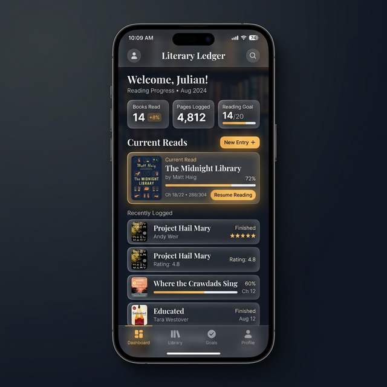

# Lorekeeper: The Golden Archive


**Lorekeeper** es un archivo digital premium diseñado para guardianes del conocimiento literario. Esta Progressive Web App (PWA) permite gestionar lecturas, capturar reflexiones y explorar un archivo de conocimiento organizado con una estética elegante y minimalista.

## ✨ Características Principales

- 📖 **Bitácora de Lectura (Reading Log):** Registra tu progreso con estados de ánimo, notas y tipos de sección.
- ⏳ **Plan de Lectura:** Organiza tus libros por fases y cronogramas semanales.
- 📚 **Enciclopedia:** Un repositorio automático de personajes, lugares y conceptos clave extraídos de tus notas.
- 🎤 **Entrada de Voz:** Dictado en español integrado para capturar pensamientos al vuelo.
- 🔮 **El Oráculo:** Un sistema que procesa tus lecturas y responde con prosa poética en español.
- 📶 **Soporte Offline:** Funciona sin conexión mediante una estrategia de caché robusta.

## 🛠️ Tecnologías



- **Frontend:** React 19 + Vite 7
- **Estilos:** Tailwind CSS 4 (Tema Zinc & Amber)
- **Animaciones:** Framer Motion
- **IA:** Gemini API para extracción de metadata y El Oráculo
- **Persistencia:** LocalStorage sincronizado

## 🚀 Instalación y Uso

1. **Instalar Dependencias:**
   ```bash
   npm install
   ```

2. **Desarrollo Local:**
   ```bash
   npm run dev
   ```

3. **Construcción para Producción:**
   ```bash
   npm run build
   ```

4. **Lint:**
   ```bash
   npm run lint
   ```

5. **Preview del Build:**
   ```bash
   npm run preview
   ```

## 📁 Estructura

```
src/
├── views/          # Vistas principales (ReadingPlan, ReadingLog, Encyclopedia, EntryForm)
├── components/     # UI compartida (MainLayout con navegación por tabs)
├── hooks/          # useLorekeeperState (contexto + estado), useLocalStorage (persistencia)
├── utils/          # ai.js (integración con Gemini API)
├── data/           # mockData.js (libros, fases, cronograma, moods, tipos de sección)
├── App.jsx         # Componente raíz con navegación por tabs
└── main.jsx        # Punto de entrada
```

---
*Preserva el conocimiento. Protege la historia.*
