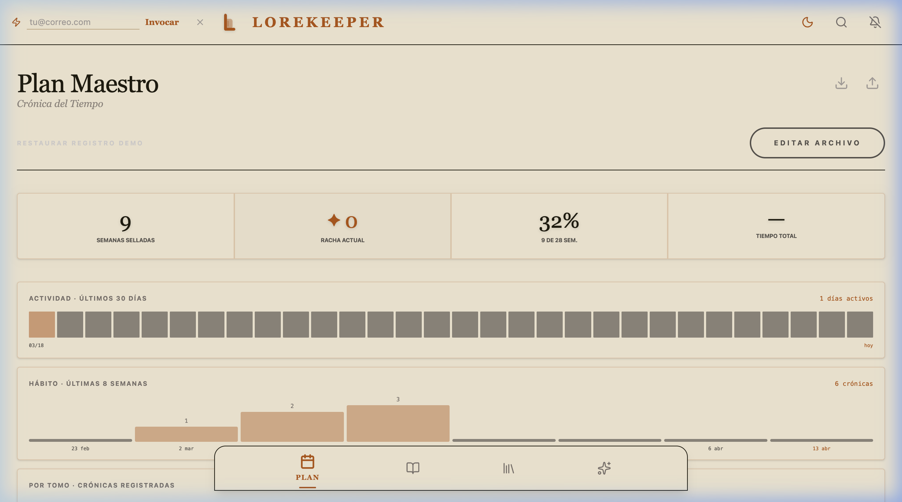
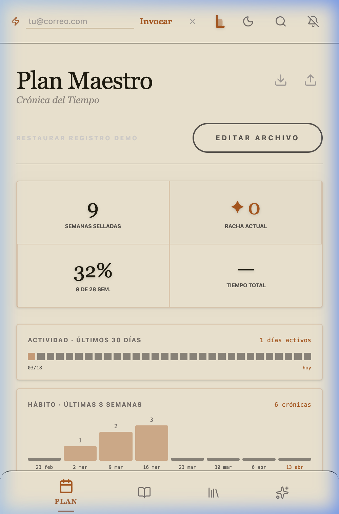
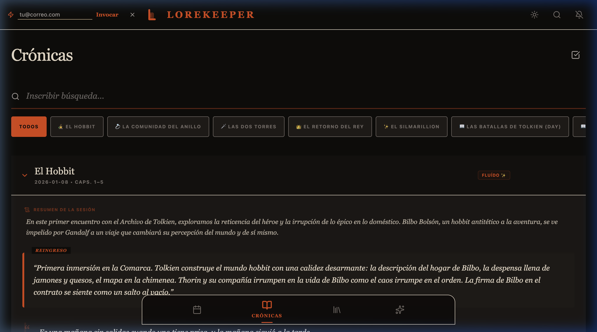
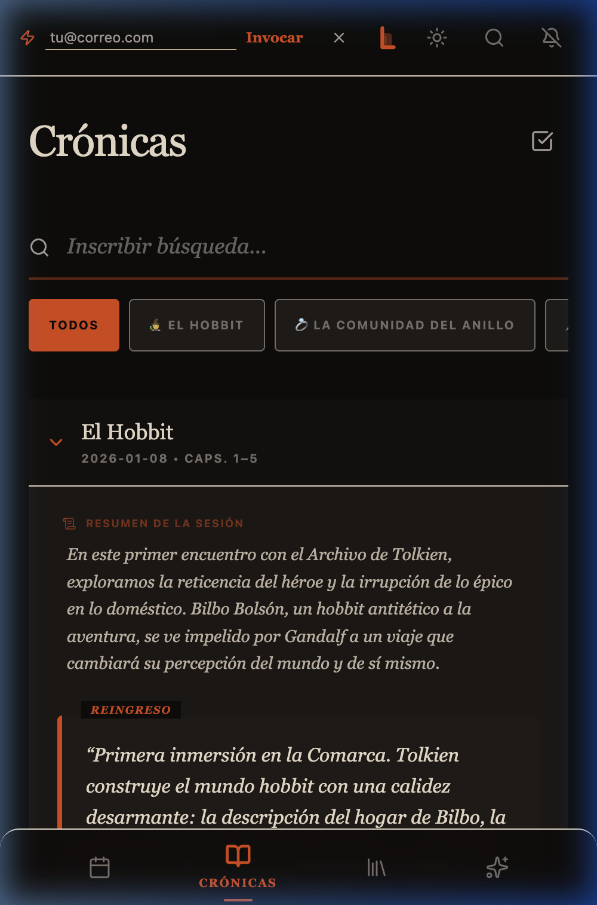
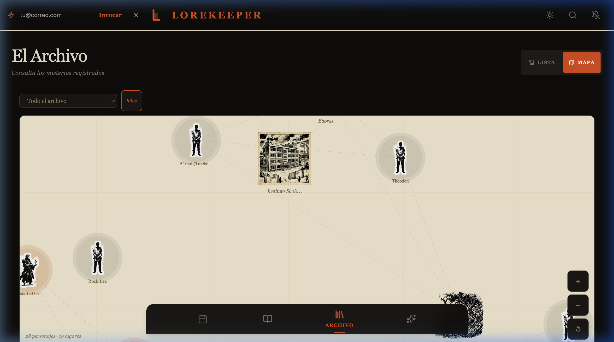
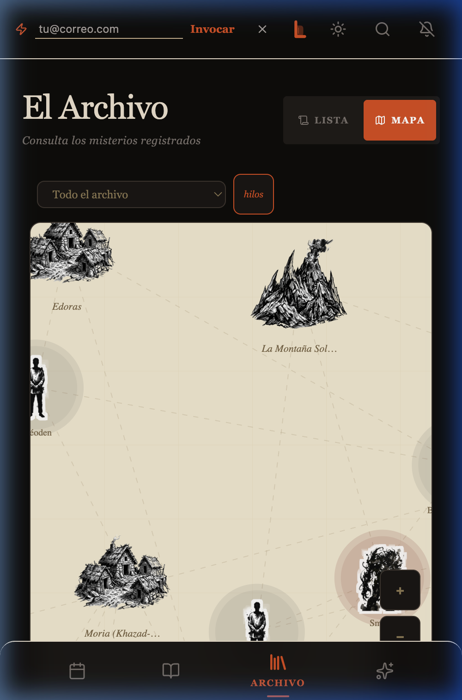

# LoreKeeper · El Grimorio del Archivero

**LoreKeeper** es una Progressive Web App (PWA) diseñada para lectores que desean trascender la simple lectura. Inspirada en la estética de los grimorios clásicos, permite llevar un registro profundo de crónicas, visualizar redes de personajes mediante un mapa de sabiduría y consultar a un Oráculo potenciado por IA.

---

### ✦ Vistas de la Aplicación

| Característica | Escritorio | Celular |
| :--- | :---: | :---: |
| **Plan Maestro**   Gestión Ritual de Lectura |  |  |
| **Crónicas**   Registro profundo (Modo Oscuro) |  |  |
| **Wisdom Map**   Redes de personajes con bruma cartográfica |  |  |

---

## ⚔️ Características Principales

### 🕸️ Wisdom Map (Mapa de Sabiduría)
Motor de visualización que genera una red de conexiones entre personajes y lugares a partir de tus crónicas. Incluye **bruma cartográfica** (fog of war) que revela el mapa sólo alrededor de los nodos conocidos, pan/zoom, filtro por libro y visualización de hilos de co-ocurrencia. Panel lateral de **relaciones** para inspeccionar conexiones entre entidades, **deduplicación** de nodos duplicados y **filtros** por categoría y relevancia.

### 📜 Plan Maestro (Rituales)
Sistema de gestión de lectura inspirado en "rituales" semanales. Organiza tus libros y arcos de lectura por fases. Detecta automáticamente **semanas huérfanas** (fuera de rango de cualquier era) para mantener el cronograma íntegro. Cabecera sticky con estadísticas de progreso, racha y tiempo total de lectura.

### ✍️ Crónicas de Lectura
Editor enriquecido para registrar momentos clave. Incluye captura de imágenes, detección automática de entidades (personajes/lugares) y un **cajón de referencia de lore** — consulta el Archivo completo sin cerrar la crónica activa. Las entradas se revelan con **animaciones de inscripción** vinculadas al scroll (scroll-driven animations), evocando un manuscrito que se escribe solo.

### 📖 El Archivo (Encyclopedia)
Agrega automáticamente personajes, lugares, glosario y reglas del mundo a partir de todas tus entradas. Cada entidad puede recibir una **Esencia Permanente**: descripción canónica editable que persiste en el grimorio. Cabecera sticky con búsqueda y filtros integrados, vista de lista o mapa según preferencia.

### 🔮 El Oráculo de Lore
Integración con la API de **Google Gemini**. El Oráculo conoce tu archivo personal y puede responder preguntas sobre la trama, sugerir conexiones entre personajes o predecir giros basados en tu progreso actual. Interfaz rediseñada con tipografía ritual **Cinzel**, inscripciones sobre pergamino y acceso directo a **Visiones del Archivo** (análisis global de tus crónicas).

---

## 📱 PWA & Experiencia Móvil

LoreKeeper está optimizado para instalarse y usarse desde el celular como app nativa:

- **Instalable** en Android (Chrome) e iOS (Safari) via Web App Manifest
- **Offline-first**: todas las crónicas y entidades viven en localStorage + IndexedDB
- **Teclado virtual inteligente**: la barra de navegación se oculta cuando el teclado bloquea la pantalla
- **Header auto-oculto**: se retrae al desplazar hacia abajo, reaparece al subir
- **Cabeceras sticky por vista**: búsqueda y filtros siempre accesibles al hacer scroll
- **Memoria de posición por pestaña**: al volver a una pestaña, el scroll se restaura exactamente donde quedó
- **Retroalimentación háptica**: vibración diferenciada en éxito, error, navegación y guardado
- **Soundscape**: susurro de papel al cambiar pestaña, rasguño de pluma al guardar (opcional, navegador permitting)
- **Bloqueo de scroll en modales**: sin deslizamiento accidental del fondo en iOS
- **Sin zoom automático en inputs**: `font-size: max(16px, 1em)` previene el auto-zoom de Safari
- **Reduced motion**: respeta `prefers-reduced-motion` del sistema
- **theme-color adaptativo**: barra del navegador en color pergamino (claro) u oscuro según el sistema

---

## 🛠️ Stack Tecnológico

- **Frontend**: React 19 (Hooks avanzados, Suspense, Lazy Loading)
- **Estilo**: Tailwind CSS 4 con sistema de diseño "Grimorio Dorado" (Dark/Light mode real)
- **Animaciones**: Framer Motion para transiciones de página y micro-interacciones; CSS scroll-driven animations para revelado de crónicas
- **Backend & Sync**: Supabase para autenticación y respaldo en la nube (opcional — degrada sin variables de entorno)
- **IA**: Google Gemini para el Oráculo y extracción automática de metadata
- **PWA**: vite-plugin-pwa (generateSW), soporte offline, notificaciones push de recordatorio

---

## 🏛️ Filosofía de Diseño: "El Grimorio"

LoreKeeper no es una herramienta de productividad; es un artefacto. La interfaz busca evocar la sensación de un libro antiguo y valioso:
- **Tipografía**: Playfair Display / Cinzel (títulos rituales), Inter (UI), Source Serif 4 (cuerpo)
- **Paleta**: pergamino `#f4ead5` / ámbar dorado `#b45309` en claro; `#0c0a08` / ámbar `#f59e0b` en oscuro
- **Interactividad**: cada acción tiene peso — forjar una entrada, sellar una semana, explorar el mapa bajo la bruma, consultar al Oráculo

---

## 🚀 Instalación y Desarrollo

1. Clona el repositorio: `git clone https://github.com/juandavidperez/LoreKeeper.git`
2. Instala dependencias: `npm install`
3. Configura las variables de entorno (`.env.local`):
   - `VITE_SUPABASE_URL`
   - `VITE_SUPABASE_ANON_KEY`
   - `VITE_GEMINI_API_KEY`
4. Inicia el servidor de desarrollo: `npm run dev`

| Comando | Acción |
| :--- | :--- |
| `npm run dev` | Servidor de desarrollo con HMR |
| `npm run build` | Build de producción en `dist/` |
| `npm run preview` | Vista previa del build |
| `npm run test` | Tests con Vitest |
| `npm run lint` | ESLint |

---

*Desarrollado con pasión por la lectura y el código limpio. 2026.*
